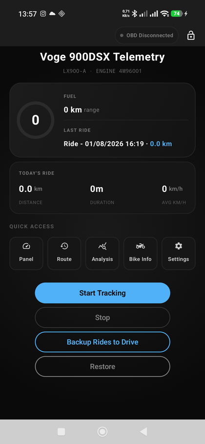
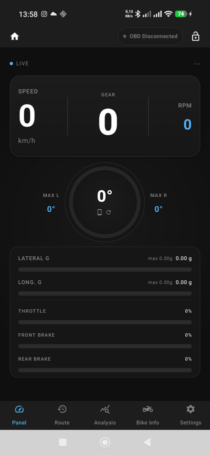
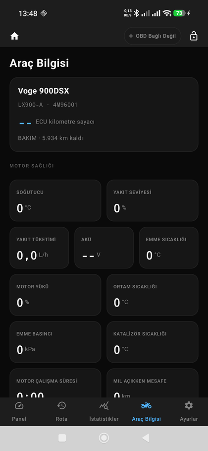
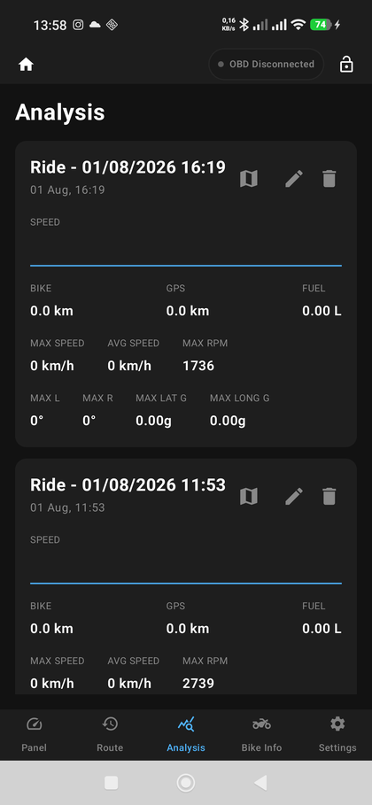
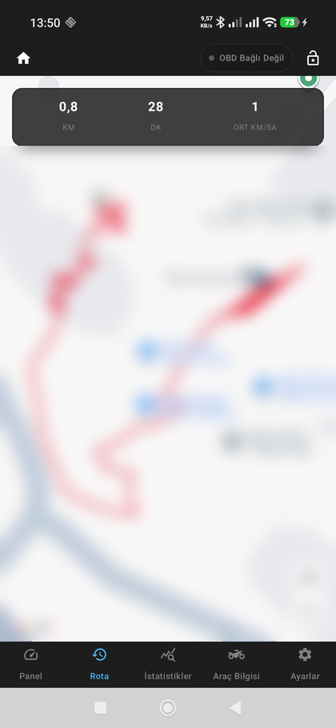
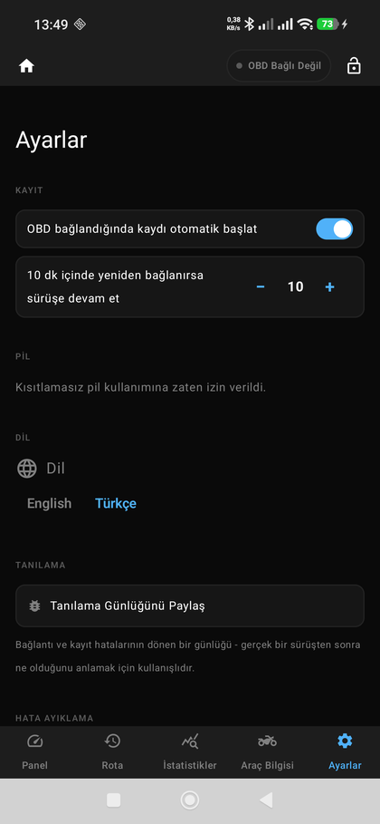

# Moto Telemetry App - Voge 900DSX (LX900-A)

This project is an Android telemetry application specifically optimized for the **Voge 900DSX** (Factory Model Code: **LX900-A**, also known as **DS900X**).

The application leverages the fact that this motorcycle shares the **BMW F900 architecture** and uses the **4M96001** twin-cylinder engine block (manufactured by Loncin), making it compatible with advanced BMW UDS diagnostic protocols.

**Test vehicle dash cluster firmware:** HW `SS621-L8`, OS `SS621X11-OS-V2.3.2`, HMI `SS621X11-HMI-V4.7`, MCU SW `SS621X11-10`. Every PID/DID in `docs/confirmed_pids.md` was verified against this exact dash - a different HW/OS/HMI/MCU version on your own bike may behave differently, especially for signals not yet mapped.

## 🚀 Key Features

- **Live Engine Data (OBD2):** Speed, RPM, Gear, Throttle, Front/Rear Brake Pressure, and a full engine-health grid (coolant, fuel, battery, temps, etc.) over a Bluetooth ELM327 adapter, standard PIDs and BMW/Voge UDS DIDs alike.
- **Physical Analysis (IMU):** Real-time Lean Angle and G-Force from the phone's sensors or the bike's own IMU, with one-tap calibration.
- **Route Tracking (GPS) & Data Logging:** Rides recorded to a local database at 5Hz with a map view of the route, independent of whether an OBD2 adapter is connected.
- **Auto-Start & Ride Continuation:** Starts recording the moment the OBD adapter connects, and rides through a short stop (red light, fuel stop) instead of splitting into a new session.
- **Diagnostics:** Check-engine/DTC handling, a live green/red/gray status table for every known signal, standard-PID and manufacturer-DID sweeps, a raw CAN bus monitor for reverse-engineering unmapped signals, and a gated UDS Extended Diagnostic Session probe.
- **Cloud Backup & Diagnostics Upload:** Ride data and diagnostic captures both push to Google Drive, so a real-world test can be reviewed remotely without connecting the phone to a computer.
- **Multi-language:** Full English/Turkish UI.

Full feature list on the [wiki](https://github.com/sertels/MotoTelemetryApp/wiki).

## 🛠 Tech Stack

- **Language:** Kotlin
- **UI:** Jetpack Compose (Material 3), hand-drawn Canvas charts
- **Architecture:** MVVM (Service → ViewModel → Compose UI, via StateFlow)
- **Database:** Room Database
- **Connectivity:** Bluetooth Classic (RFCOMM), OBD-II Mode 01/03/04, and UDS (ISO 14229) Service 0x22 ReadDataByIdentifier
- **Location:** Google Play Services Fused Location
- **Navigation:** Jetpack Navigation
- **Cloud:** Google Drive API

## 📋 Setup and Usage

1.  **Google Maps API:** Add a line `MAPS_API_KEY=your_key_here` to `local.properties` (gitignored, created by Android Studio) — `app/build.gradle.kts` reads it into a manifest placeholder, so it's never committed. Restrict the key in Cloud Console to your app's package name + signing SHA-1 and the Maps SDK for Android API, since it still ships inside the APK regardless.
2.  **Google Drive Backup/Restore (optional):** Needs a Google Cloud project with two OAuth 2.0 clients in the *same* project:
    - An **Android** client with package name `com.example.mototelemetryapp` and the SHA-1 of your signing certificate (`keytool -list -v -keystore <keystore> -alias <alias>`).
    - A **Web application** client — its ID is what goes into `setServerClientId(...)` in `MainActivity.kt`. Using the Android client's ID there fails with `[28444] Developer console is not set up correctly`; Credential Manager's Google Sign-In requires the Web client ID as the token audience regardless of platform.
    - While the OAuth consent screen is in **Testing** status, every Google account that needs to sign in (including your own) must be added under **Audience → Test users**, or sign-in fails with `403: access_denied`.
    - The app requests both `drive.appdata` (hidden ride-DB backups) and `drive.file` (visible diagnostics uploads, see below) scopes in one grant — add both under the OAuth consent screen's **Data Access** section, or the diagnostics upload silently fails to find/create its Drive folder.
3.  **OBD2 Adapter:** Plug your Bluetooth ELM327 adapter into the motorcycle and pair it with your phone, then connect it once from the Panel's OBD badge dropdown — the app remembers whichever device you pick there, and auto-start (below) only works for a previously-connected device. If you haven't connected one yet, the app falls back to auto-detecting a paired device whose name contains `OBD`, `ELM327`, `ELM`, `VLINK`, `V-LINK`, `ICAR`, `VGATE`, or `OBDLINK`.
4.  **Permissions:** The app will request Bluetooth, Location, and Notification permissions on the first launch.
5.  **Tracking:** Start the data collection loop and background service with the "Start Tracking" button on the main screen, or enable **Auto-start tracking when OBD connects** in Settings to have it start automatically when the adapter powers on.

## 📸 Dashboard Interface

<table>
<tr>
<td></td>
<td></td>
<td></td>
</tr>
<tr>
<td align="center">Home</td>
<td align="center">Panel</td>
<td align="center">Bike Info</td>
</tr>
<tr>
<td></td>
<td></td>
<td></td>
</tr>
<tr>
<td align="center">Analysis</td>
<td align="center">History (route blurred for privacy)</td>
<td align="center">Settings</td>
</tr>
</table>

## 📖 Documentation and Development Process

You can examine the architecture and technical details of the project in the following documents:

- [🚀 Development Walkthrough](docs/walkthrough.md) - Summary of all major subsystems and how they work.
- [📝 Implementation Plan](docs/implementation_plan.md) - Architectural decisions and patterns used across the app.
- [📡 Confirmed PIDs](docs/confirmed_pids.md) - Every OBD-II/UDS request verified to work on this bike, standard vs. manufacturer-specific, for anyone reverse-engineering the same BMW F900 platform.

These same docs are also browsable on the [project wiki](https://github.com/sertels/MotoTelemetryApp/wiki).

## ⚠️ Important Notes

- **Lean Angle:** For the most accurate measurement using phone sensors, it is recommended to mount the phone vertically and securely on the motorcycle.
- **UDS Support:** Data like brake pressure and motorcycle lean angle are BMW/Voge-specific PIDs. The readability of this data may vary depending on the quality of your ELM327 adapter.
- **CAN sweeps and the security-session probe are engine-off tools.** Probing unconfirmed CAN headers or opening a UDS Extended Diagnostic Session changes what the ECU responds to (or its session state) rather than just reading data — only the standard-PID scan and the raw CAN monitor are safe to run with the engine on.

## Contributing

Fixes or new confirmed PIDs from other BMW-F900-platform owners are welcome — see [CONTRIBUTING.md](CONTRIBUTING.md).

## License

[MIT](LICENSE)

---
*Developed by: Sertel Şekerci*
